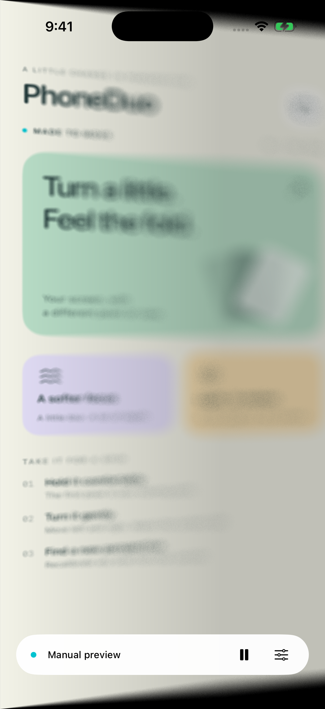
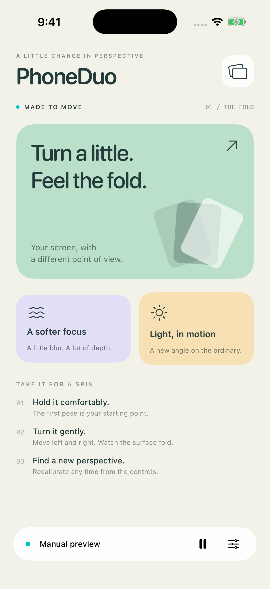
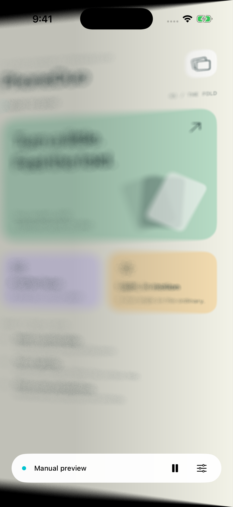

# PhoneDuo

A motion-driven iPhone app that makes its interface look like a folding pane of glass. Hold the phone comfortably, then rotate it gently left and right: perspective, progressive blur, and shading respond to the phone’s actual orientation.

<p align="center">
  
  
  
</p>

[Build and test results](Docs/VALIDATION.md) · Installed on iPhone 12 Pro Max; physical motion tuning is ongoing.

## What it does

- **On an iPhone:** Core Motion drives the effect automatically. The first pose becomes neutral. Open the controls and tap **Set this angle as neutral** to recalibrate.
- **In the simulator:** manual mode is selected automatically. Open the controls, drag **Tilt angle** between −45° and +45°, and use **Reset angle** to return to neutral.
- **Finishes:** Silk balances blur and shading, Frost adds stronger diffusion, and Clear keeps perspective with no blur or dimming.
- **Pause:** freezes the effect at a flat presentation. Resuming motion mode calibrates the current pose; manual mode retains its slider value.
- **Lifecycle:** motion stops in the background and while paused or in manual mode. Returning to the foreground recalibrates. Reduce Motion disables the visual deformation.

The effect applies to PhoneDuo’s own interface. It does not bend the iOS Home Screen or other apps. There is no screen recording, networking, account, or saved sensor history.

## Requirements

- iOS 17 or newer; iPhone with device-motion support for physical tilt.
- Xcode 16+ for the synchronized project groups; developed and checked with Xcode 26.1.1.
- An iOS simulator runtime for automated tests.
- No third-party packages. If Xcode reports a missing Metal compiler, install it with `xcodebuild -downloadComponent MetalToolchain`.

## Open and run

```sh
open PhoneDuo.xcodeproj
```

Choose the **PhoneDuo** scheme and an iPhone simulator, then press Run. Or use:

```sh
./scripts/run-simulator.sh SIMULATOR_UUID
```

List simulator IDs with `xcrun simctl list devices available`. The scripts select a booted iPhone simulator, or the first available iPhone; pass a UUID to choose another device.

## Test simulated tilt

The controls float above the folded interface so they stay usable at any angle. On the simulator, drag the slider to the left and right. Set a fixed launch angle for reproducible screenshots:

```sh
xcrun simctl terminate booted app.phoneduo.PhoneDuo
SIMCTL_CHILD_TILT_DEGREES=-25 xcrun simctl launch booted app.phoneduo.PhoneDuo
xcrun simctl io booted screenshot /tmp/phoneduo-left.png
```

Repeat with `TILT_DEGREES=0` or `25`. These are synthetic tilt inputs to the real shader, not Core Motion emulation.

## Automated checks

```sh
./scripts/test.sh SIMULATOR_UUID
./scripts/build-device.sh  # unsigned iPhone compile check
```

The 10-test unit suite checks neutral calibration, symmetric left/right rotation, rejection of cross-axis motion, bounded gyro prediction, neutral jitter, refresh-rate-independent smoothing, invalid/extreme angles, and shader sampling bounds. UI tests interact with the angle slider, reset, pause/resume, controls panel, and finish picker. Simulator screenshots verify the actual rendered shader output.

Automated checks cannot establish physical sensor latency, sign/orientation on every device, battery consumption, or how convincing the illusion feels in your hand.

## Install on your iPhone later

1. Open `PhoneDuo.xcodeproj` in Xcode.
2. Select the PhoneDuo target → **Signing & Capabilities** → choose your own team. No developer team or provisioning profile is committed.
3. If needed, change `app.phoneduo.PhoneDuo` to a bundle identifier available to your team.
4. Connect and trust your iPhone, enable Developer Mode when iOS requests it, then select the device in Xcode. For responsiveness testing, use **Product → Scheme → Edit Scheme → Run → Build Configuration → Release**, then Run.
5. Hold the phone in portrait, look straight at it, and let the first reading calibrate. Turn gently around the vertical axis, roughly keeping your head in place.
6. Check both directions, recalibration, pause/resume, app backgrounding, rotation to landscape, and Reduce Motion.

A free personal team may be sufficient for local development; distribution/TestFlight requires the appropriate Apple developer setup. No device deployment or App Store upload is performed by the scripts.

## Rendering and responsiveness

Motion is sampled at 120 Hz and the latest reading is consumed by a display link targeting 60 Hz. This avoids a backlog of sensor callbacks on the UI thread. A time-based filter, bounded prediction, and a continuous 0.2° neutral zone reduce overshoot and hinge jitter.

The shader uses a fixed 24-tap precomputed blur disk plus a center sample, capped at 14 points. Sampling bounds cover perspective displacement and blur. The controls use a simple background and observe angle changes only in the readout. Use a Release build when evaluating performance on a phone.

For repeatable rendering checks, launch with `--performance-sweep` to animate a ±30° preview. Relaunch without the argument to return to normal sensor input. This exercises rendering; it does not validate sensor response.

## Source map

| File | Purpose |
| --- | --- |
| `PhoneDuo/FoldMotionModel.swift` | Core Motion attitude, calibration, orientation handling |
| `PhoneDuo/FoldMath.swift` | Pure angle calculation, filtering, bounds |
| `PhoneDuo/FoldEffect.swift` | SwiftUI shader modifier and optical parameters |
| `PhoneDuo/Shaders/DuoFold.metal` | Perspective reprojection, variable blur, shading |
| `PhoneDuo/ContentView.swift` | Lifecycle and controls outside the effect |
| `PhoneDuo/DemoContentView.swift` | Pure SwiftUI demo surface |
| `PhoneDuoTests/` | Motion math regression tests |
| `PhoneDuoUITests/` | Simulator interaction tests |

Content inside the effect must be compatible with SwiftUI’s shader layer. The subtree is flattened before shading; UIKit-backed controls and scrolling containers should remain outside that layer.

## License

Licensed under the [MIT License](LICENSE).
